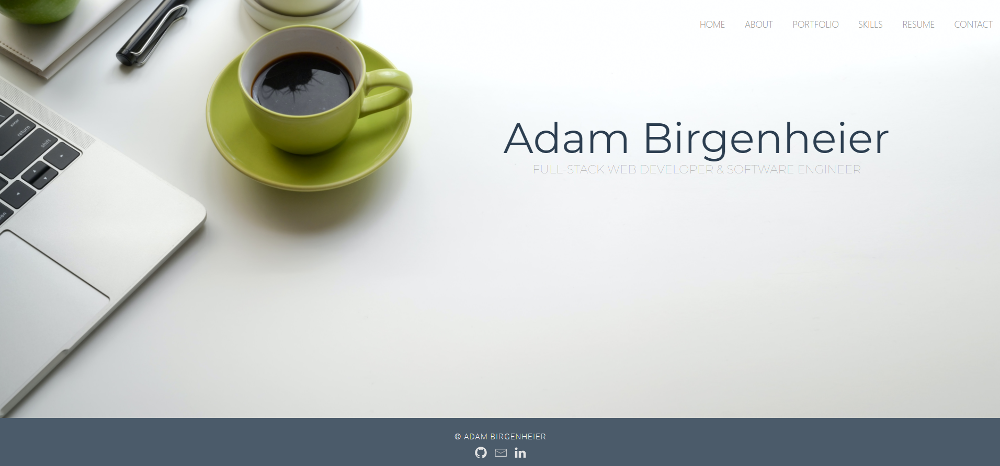

# [React Portfolio](http://jpreston-alt.github.io/react-portfolio)

## Description

Hi! Thank you for checking out my portfolio. This is a full-stack MERN portfolio-website deployed on Heroku.com utilizing DNS connection with GoDaddy.com. I utilized tools learned from the University of Washington Full Stack Web Development Program, as well as lecturers from Udemy and YouTube to put together the most dynamic, versatile, and user-friendly website to my ability.

From graduating from the Full Stack Program to current enrollment in Python Programming, I have fostered a passion for back-end software and database development. On the portfolio page of the [deployed site](http://adambirgenheier.com) are the "Top Rated" Applications, which are highlighted due to the intricate and serviceable foundations which power and drive the utility of the application.

Thanks for checking it out!

 

 

## Technologies

- React
- HTML
- CSS
- [UIKit](https://getuikit.com/)
- JavaScript
- [Animate.css](https://animate.style/)
- [MongoDB](https://mongodb.com/)
- [Github API](https://github.com/)

## Finished Product

View deployed site [here](http://adambirgenheier.com).  

##### You can also view an alternative version of the website [here](https://adambirgenheier.herokuapp.com/).  

## Contact Me

On GitHub: [Adambear1](https://github.com/Adambear1) | Via Email: adamcarlbirgenheier@gmail.com
